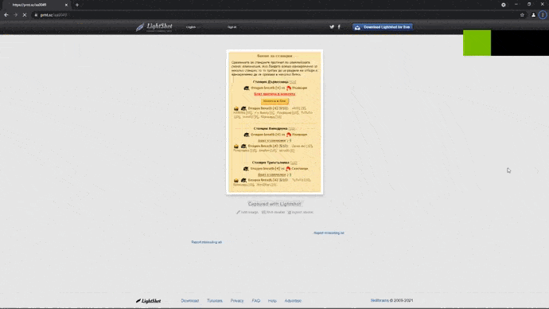

# LightShot Security Research Tool

[](https://www.python.org/)
[](https://selenium-python.readthedocs.io/)
[](LICENSE)
[](https://github.com/NC1107)
[](https://www.linkedin.com/in/nicholas-conn-41b1b120a/)
[](mailto:188623nc@gmail.com)

## 🔬 Overview

This repository contains a security research tool that demonstrates vulnerabilities in LightShot's URL structure. The tool systematically explores how predictable URL patterns can potentially lead to unauthorized access to user-uploaded screenshots.

## ⚠️ Ethical Disclaimer

**This project is strictly for educational and security research purposes only.**

- 🚫 Do not use this tool for malicious purposes
- 🚫 Do not violate terms of service or rate limits
- 🚫 Do not access content without proper authorization
- ✅ Use responsibly for security education and awareness
- ✅ Respect server resources and implement appropriate delays

## 🛠️ Technical Background

LightShot generates URLs with a predictable structure:
- Base URL: `https://prnt.sc/`
- Pattern: `[a-z][a-z][0-9][0-9][0-9][0-9]`

This research tool demonstrates how this predictable pattern could theoretically be exploited, highlighting the importance of using unpredictable, cryptographically secure URL generation for sensitive content.

## 📋 Prerequisites

- Python 3.8 or higher
- Google Chrome browser
- ChromeDriver (included in `driver/` directory)
- Internet connection

## 🚀 Installation

1. **Clone the repository:**
   ```bash
   git clone https://github.com/NC1107/prnt.sc-ripper.git
   cd prnt.sc-ripper
   ```

2. **Install dependencies:**
   ```bash
   pip install -r requirements.txt
   ```

3. **Verify ChromeDriver:**
   The repository includes ChromeDriver binaries. Ensure the correct path is configured for your system.

## 💻 Usage

### Basic Usage

```bash
python main.py
```

### Advanced Options

```bash
# Limit the number of attempts
python main.py --max-attempts 500

# Increase delay between requests (recommended)
python main.py --delay 2.0

# Run in visible browser mode
python main.py --visible

# Custom output directory
python main.py --output-dir custom_screenshots

# Custom ChromeDriver path
python main.py --driver-path /path/to/chromedriver
```

### Command Line Arguments

| Argument | Description | Default |
|----------|-------------|---------|
| `--driver-path` | Path to ChromeDriver executable | `driver/chromedriver_win32 (1)/chromedriver.exe` |
| `--output-dir` | Directory to save screenshots | `images` |
| `--max-attempts` | Maximum number of URLs to attempt | `1000` |
| `--delay` | Delay between requests (seconds) | `1.0` |
| `--visible` | Run browser in visible mode | `False` |

## 📊 Demo



*The demo shows the script systematically accessing LightShot URLs and saving any discovered screenshots locally.*

## 🏗️ Project Structure

```
prnt.sc-ripper/
├── main.py                    # Main application script
├── requirements.txt           # Python dependencies
├── README.md                 # Project documentation
├── LICENSE                   # License file
├── .gitignore               # Git ignore rules
├── images/                  # Output directory for screenshots
├── demo/                    # Demo files and documentation
│   └── Demo.gif
└── driver/                  # ChromeDriver binaries
    ├── chromedriver_win32/
    └── chromedriver_win32 (1)/
```

## 🔧 Features

- **Professional Code Structure**: Object-oriented design with proper error handling
- **Comprehensive Logging**: Detailed logging for debugging and monitoring
- **Command Line Interface**: Flexible options for different use cases
- **Rate Limiting**: Built-in delays to respect server resources
- **Cross-Platform Support**: Works on Windows, macOS, and Linux
- **Error Recovery**: Robust exception handling and graceful degradation

## 🧪 Security Research Insights

This tool helps demonstrate several important security concepts:

1. **Predictable URL Structures**: The risks of using sequential or predictable patterns
2. **Information Disclosure**: How publicly accessible content can be discovered
3. **Rate Limiting**: The importance of implementing proper API rate limits
4. **Access Controls**: The need for proper authentication and authorization

## 📝 Logging

The application generates detailed logs in `lightshot_research.log`, including:
- Successful screenshot captures
- Failed attempts and reasons
- Progress updates
- Error messages and debugging information

## 🤝 Contributing

This is an educational project. If you have suggestions for improvements or additional security research insights, please:

1. Fork the repository
2. Create a feature branch
3. Submit a pull request with detailed description

## 📄 License

This project is released under an **Educational Use Only** license. See [LICENSE](LICENSE) for details.

## 🛡️ Responsible Disclosure

If you discover security vulnerabilities in any service while using this educational tool, please:

1. Report them responsibly to the affected service
2. Allow reasonable time for remediation before public disclosure
3. Follow coordinated vulnerability disclosure practices

## 📚 Further Reading

- [OWASP Web Security Testing Guide](https://owasp.org/www-project-web-security-testing-guide/)
- [Responsible Disclosure Guidelines](https://en.wikipedia.org/wiki/Responsible_disclosure)
- [Web Application Security Best Practices](https://owasp.org/www-project-application-security-verification-standard/)

## 📧 Contact

For questions about this educational project:

- **GitHub**: [@NC1107](https://github.com/NC1107)
- **LinkedIn**: [Nicholas Conn](https://www.linkedin.com/in/nicholas-conn-41b1b120a/)
- **Email**: [188623nc@gmail.com](mailto:188623nc@gmail.com)

---

**Remember: Use this tool responsibly and ethically. Security research should always aim to improve digital safety for everyone.**
